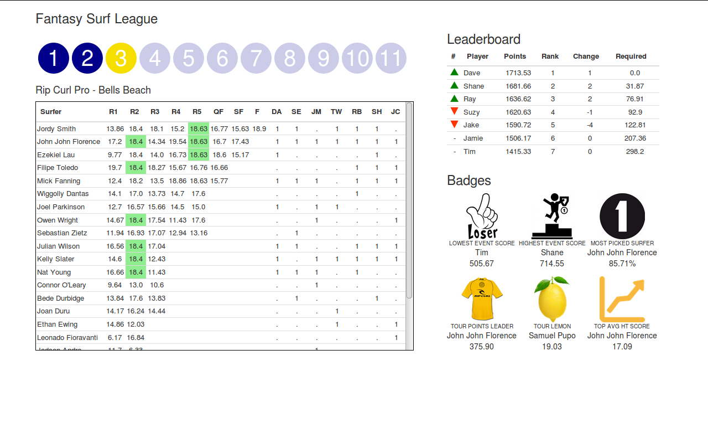

# Surf Fantasy Dashboard

Alternative documentation format found [here](rayblick.github.io/fantasy-surf-league/README).

## Aim
The world surf league runs a fantasy sports competition that myself and friends play (players). The existing information available on web and mobile apps are limited. Therefore, the aim of this project is to create a dashboard to more effectively track the changes that occur between events.

## Scope
+ Mens competition
+ "Fixed" html page showing current results for the fantasy surf competition
+ Allow players to select previous tour "stops" to see previous results
+ Deploy application in a publically accessible location
+ Use bootstrap CSS styling
+ Test the points/results for consistency with the official app

## Out of Scope
+ Webcrawler to extract data
+ Mobile friendly pages
+ Login security
+ User sign-in
+ Administrative privileges
+ Reactive figures (e.g. D3.js)
+ Realtime updates during events
+ Displaying results for other teams
+ Comments for player interaction
+ Social media interaction
+ Displaying results from previous years
+ Displaying a full listing of surfer results
+ Popups and modals for additional info

## Assumptions   
+ The number of page views will not exceed a free account to deploy

## Time
+ 45 hours (3 hour blocks over 15 nights while the baby is sleeping)

## Status
Complete

## Contributors
+ Ray Blick


## WSL Surf Fantasy
The world surf league is the governing body of "The World Championship Tour" or "CT" which is a surfing competition for the worlds best. To be on the CT the (male) surfers can (1) qualify on the World Qualifying Series (WQS; top 10), (2) already be on tour and perform reasonably well the year before (top 22), or (3) be a wildcard (2 surfers). There are differences in the womans World Championship Tour which need to be considered in the data collection and transformation steps.

**Considerations:**

+ Heats can consist of 2 or 3 surfers
+ Heats scored as 2 best waves
+ A ride is scored out of 10 (20 point total)
+ 5 rounds, Quarter Final, Semi Final, Final (Men)
+ 4 rounds, Quarter Final, Semi Final, Final (Women)
+ Elimination rounds differ for men and women
+ 11 events ("stops") per year (men)
+ 10 events ("stops") per year (women)
+ Not all events overlap for men and women
+ Event order can change
+ New events can occur each year
+ Beach choice changes relative to conditions
+ Bonus points are given for heats 2 and 4 for winners of heats 1 and 3
+ Bonus points = maximum heat total by any surfer for that round

## Naming conventions
+ "Surfer" refers to the sports competitior  
+ "Player" refers to users of the fantasy competition  

## Project layout
This project is separated into three main sections, including (1) data, (2) db, and (3) the django application (named "fantasy"). The development of this project evolved following this sequence of data collection, processing and visualisation. For more detail refer to the sections below.    
```
Project
|
├── data
│   ├── Events_DIM.csv #Manual data collection
│   ├── Events_FACT.csv
│   ├── Picks_FACT.csv
│   ├── Player_DIM.csv
│   └── Rounds_DIM.csv
|
├── db
│   ├── DB_CREATOR #Processes data to create fantasydb
│   └── fantasydb #sqlite3 DB
|
├── DEVLOG.md #Project change log
|
├── fantasy # Django (redacted)
│   ├── dashboard #App
│   │   ├── static
│   │   │   ├── css
│   │   │   └── img
│   │   ├── templates
│   │   │   └── dashboard
│   │   ├── templatetags
│   │   ├── ...
│   ├── db.sqlite3 # default django database
│   ├── fantasy
│   │   └── ...
│   ├── fantasydb #sqlite3 (copy)
│   └── manage.py
|
└── README.md
```

## Data
Before collecting these data I had a fairly good idea of what I wanted to achieve. Specifically I wanted a leader board containing cumulative point totals and position change information (e.g. drop from 1st to 5th position after x event). All points are to be derived from the event results which needs to include points from bonus rounds.

All data were "manually" collected (not webscrapping) in a partially normalised form by creating three dimensions and two fact tables. The dimensions contain information that are not likely to change throughout the year but there could be some duplication. For example, multiple events can occur in the same country, if I added a country column to the events table then I would not create a countries table. The dimensions include event information, player information (us not the surfers) and round information. The fact tables include picks (player selections) and events (surfer results).  

**Events_DIM.csv**
+ Event id
+ Name
+ Location
+ Country

**Rounds_DIM.csv**
+ Round id
+ Name

**Player_DIM.csv**
+ Player id
+ Name

**Picks_FACT.csv**
+ id
+ Player id
+ Event id
+ Round start #No points for missed rounds e.g. a player makes pick late
+ Surfer Name

**Events_FACT.csv**
+ id
+ Event id
+ Round id
+ Heat Number
+ Surfer Name
+ Score 1
+ Score 2
+ Total heat score
+ Info Flag
+ Notes

## Database
The steps in the following code blocks are used to create a database that holds the summary tables required in the Django application (These become Django "models"). The final sqlite database created here is copied to the appropriate location in the django application after creation. The full listing is available in "db/DB_CREATOR.txt". You can copy and paste this listing into an sqlite shell.

### Create DB
```bash
sqlite3 fantasydb
```  

### Import Data
```sql
/* SQLite shell */
/* Import csv files to SQLite3 */
.mode csv

/* Events_DIM */
DROP TABLE IF EXISTS Events_DIM;
CREATE TABLE Events_DIM(event_id INTEGER PRIMARY KEY,
                        event_name TEXT,
                        event_location TEXT,
                        event_country TEXT);
.import ../data/Events_DIM.csv Events_DIM

/* player_DIM */
DROP TABLE IF EXISTS Player_DIM;
CREATE TABLE Player_DIM(player_id INTEGER PRIMARY KEY,
                        player_name TEXT);
.import ../data/Player_DIM.csv Player_DIM

/* Rounds_DIM */
DROP TABLE IF EXISTS Rounds_DIM;
CREATE TABLE Rounds_DIM(round_id INTEGER PRIMARY KEY,
                       round_name TEXT);
.import ../data/Rounds_DIM.csv Rounds_DIM

/* Picks_FACT*/
DROP TABLE IF EXISTS Picks_FACT;
CREATE TABLE Picks_FACT(picks_id INTEGER PRIMARY KEY,
                        player_id INTEGER,
                        event_id INTEGER,
                        round_start_id INTEGER,
                        surfer_name TEXT);
.import ../data/Picks_FACT.csv Picks_FACT

/* Events_FACT */
DROP TABLE IF EXISTS Events_FACT;
CREATE TABLE Events_FACT(id INTEGER PRIMARY KEY,
                    event_id INTEGER,
                    round_id INTEGER,
                    heat INTEGER,
                    surfer_name TEXT,
                    score1 REAL,
                    score2 REAL,
		    total REAL,
                    flag TEXT,
                    note TEXT);
.import ../data/Events_FACT.csv Events_FACT
```

### Create Fantasy Picks Table (Django Model)
```sql
DROP TABLE IF EXISTS FantasyPicks;
CREATE TABLE FantasyPicks(id, INTEGER PRIMARY KEY,
                        player_name TEXT,
                        event_id INTEGER,
                        event_name TEXT,
                        round_start_id INTEGER,
                        surfer_name TEXT);

INSERT INTO FantasyPicks
    (id, player_name, event_id, event_name, round_start_id, surfer_name)
    SELECT picks_id,
       players.player_name,
       events.event_id,
       events.event_name || ' - ' || events.event_location,
       picks.round_start_id,
       picks.surfer_name
    FROM Picks_FACT picks
    JOIN Player_DIM players
       ON players.player_id = picks.player_id
    JOIN Events_DIM events
       ON events.event_id = picks.event_id;
```

### Creating "VIEW" to handle bonus rounds
```sql
DROP VIEW MaxBonusRound;
CREATE VIEW MaxBonusRound as
SELECT event_id, round_id, max(total) as high_score
FROM Events_FACT
WHERE round_id IN (2, 5)
GROUP BY event_id, round_id;

DROP VIEW SurferBonusRounds;
CREATE VIEW SurferBonusRounds as
SELECT sbr.event_id,
       sbr.bonusRound,
       sbr.bonusflag,
       sbr.surfer_name,
       mbr.high_score
FROM (SELECT event_id,
             round_id,
             (round_id+1) as bonusRound,
             surfer_name,
             'b' as bonusflag,
             max(total)
      FROM Events_FACT
      WHERE round_id IN (1, 4)
      GROUP BY event_id, round_id, heat) sbr
LEFT JOIN MaxBonusRound mbr
ON sbr.event_id=mbr.event_id
AND sbr.bonusRound=mbr.round_id;
```

### Create Fantasy Points Table
Appends bonus rounds to the points table
```sql
DROP TABLE IF EXISTS FantasyPointsTable;
CREATE TABLE FantasyPointsTable (
                    id INTEGER PRIMARY KEY AUTOINCREMENT,
                    event_id INTEGER,
                    round_id INTEGER,
                    bonusflag TEXT,
                    surfer_name TEXT,
                    total REAL);

INSERT INTO FantasyPointsTable
    (event_id, round_id, bonusflag, surfer_name, total)
    SELECT event_id, bonusRound, bonusflag, surfer_name, high_score
    FROM SurferBonusRounds;

INSERT INTO FantasyPointsTable
    (event_id, round_id, bonusflag, surfer_name, total)
    SELECT event_id, round_id, '', surfer_name, total
    FROM Events_FACT;
```

### Create Leaderboard
```sql
DROP TABLE IF EXISTS FantasyPlayerScore;
CREATE TABLE FantasyPlayerScore (
                    id INTEGER PRIMARY KEY AUTOINCREMENT,
                    event_id INTEGER,
                    player_name TEXT,
                    player_points REAL);

/* Note the join to picks fact and player dim */
/* A key part of this sql statement is the round id join on
round_start_id - this ensures that players dont get points for
late picks */

INSERT INTO FantasyPlayerScore
     (event_id, player_name, player_points)
     SELECT fpt.event_id, pd.player_name, sum(fpt.tot)
          FROM(
               SELECT event_id, round_id, surfer_name, sum(total) as tot
               FROM FantasyPointsTable
               GROUP BY event_id, surfer_name) fpt
     JOIN Picks_FACT pf
          ON fpt.surfer_name = pf.surfer_name
          AND fpt.event_id = pf.event_id
          AND fpt.round_id >= pf.round_start_id
     JOIN Player_DIM pd
          ON pf.player_id = pd.player_id
     GROUP BY fpt.event_id, pd.player_name;
```

### Add Running Totals to the Leaderboard
```sql
/* Joining on player_name and all event id's groups the
data to generate running totals */
DROP VIEW FantasyPlayerRunningTotals;
CREATE VIEW FantasyPlayerRunningTotals AS
SELECT t1.id, t1.event_id, t1.player_name, t1.player_points,
     (
     SELECT SUM(t2.player_points)
     FROM FantasyPlayerScore t2
     WHERE t2.event_id <= t1.event_id
     AND t2.player_name = t1.player_name
     ) as accumulated
FROM FantasyPlayerScore t1;
```

### Add Event Rank and Tour Rank to the Leaderboard
```sql
DROP VIEW IF EXISTS FantasyPlayerRanking;
CREATE VIEW FantasyPlayerRanking AS
SELECT  p1.*, (
        SELECT COUNT(*)+1
        FROM FantasyPlayerRunningTotals as p2
        WHERE p2.player_points > p1.player_points
        AND p2.event_id = p1.event_id
        ) as eventrank,
        (
        SELECT COUNT(*)+1
        FROM FantasyPlayerRunningTotals as p2
        WHERE p2.accumulated > p1.accumulated
        AND p2.event_id = p1.event_id
        ) as tourrank
FROM    FantasyPlayerRunningTotals as p1
ORDER BY p1.event_id, tourrank;
```

### Add Change in Rank to the Leaderboard
```sql  
DROP VIEW IF EXISTS FantasyPlayerStatus;
CREATE VIEW FantasyPlayerStatus AS
SELECT p1.*, (tourrank - (
   SELECT tourrank
   FROM FantasyPlayerRanking as p2
   WHERE p2.event_id = p1.event_id-1
   AND p2.player_name = p1.player_name
   )) * -1 as rankchange
FROM FantasyPlayerRanking as p1;
select * from FantasyPlayerStatus;
```

### Add Required Points to the Leaderboard
```sql  
DROP TABLE IF EXISTS FantasyLeaderBoard;
CREATE TABLE FantasyLeaderBoard AS
SELECT p1.*, ROUND((
    SELECT MAX(accumulated)
    FROM FantasyPlayerStatus as p2
    WHERE p2.event_id = p1.event_id
    GROUP BY event_id
    ) - p1.accumulated, 2) as requiredpoints
FROM FantasyPlayerStatus as p1;
```

### Drop tables not needed in the django app
```sql  
DROP TABLE Events_DIM;
DROP TABLE Player_DIM;
DROP TABLE Rounds_DIM;
DROP TABLE Picks_FACT;
DROP TABLE Events_FACT;
DROP VIEW MaxBonusRound;
DROP VIEW SurferBonusRounds;
DROP TABLE FantasyPlayerScore;
DROP VIEW FantasyPlayerRunningTotals;
DROP VIEW FantasyPlayerRanking;
DROP VIEW FantasyPlayerStatus;
```

### Tables Remaining (Django Models)  
```sql
SELECT * FROM FantasyPicks;
SELECT * FROM FantasyPointsTable;
SELECT * FROM FantasyLeaderBoard;
```

## Dashboard
The dashboard was created using Django and deployed on Pythonanywhere.com. Basic HTML and CSS syntax in this dashboard are not covered in this documentation.

**Requirements:**
+ Python
+ Django
+ HTML
+ CSS

### Design
The template for this dashboard started with pen to paper before collecting data. I had listed all the features I wanted to display and I had a rough idea of the layout. The main feature that I wanted to include was a comparison table showing which surfers each player had selected and provide some metric of how well that surfer performed.  

The final design has four main features:
1. Information area (e.g current event)
2. Leaderboard (e.g player rank and position change)
3. Badges (e.g. lowest/highest points per event)
4. Picks board (i.e. surfers, results, and selections by players)

### Create Django Project and App
Refer to https://docs.djangoproject.com/en/1.11/intro/tutorial01/ for help.
```bash
django-admin startproject fantasy
python3.4 manage.py startapp dashboard
```

### Generate Django Models from SQLite Database
Copy and paste the database (fantasydb) to the parent directory of the fantasy project. Note that the code generated in models.py was reviewed and modified in several places. For example, several IntegerFields were auto-generated as TextFields.   
```bash
# Generate code for models.py
python3.4 manage.py inspectdb --database=fantasydb > dashboard/models.py
```

### Database setup (fantasy/settings.py)
```python
INSTALLED_APPS = [
     'dashboard.apps..DashboardConfig',
     ...
]

DATABASES = {
    'default': {
        'ENGINE': 'django.db.backends.sqlite3',
        'NAME': os.path.join(BASE_DIR, 'db.sqlite3'),
    },
    # this is the new db
    'fantasydb': {
        'ENGINE': 'django.db.backends.sqlite3',
        'NAME': os.path.join(BASE_DIR, 'fantasydb'),
        'USER': '',
        'PASSWORD': '',
        'HOST': '',
        'PORT': '',
    },
}

```
### urls.py (dashboard app)
I am using two urls. The first url is the homepage that will route the user to the latest data (this functionality is done in views.py). The second url uses an integer in the url to locate the appropriate data. For example, http://127.0.0.1:8000/dashboard/2 will redirect the user to the data for the second event.    

```python
from django.conf.urls import url
from . import views

urlpatterns = [
    url(r'^$', views.index, name='index'),
    url(r'^(?P<eventid>[0-9]+)/$', views.championshiptour, name='championshiptour'),
]
```

### Create User
```bash
python3.4 manage.py createsuperuser
# Follow prompts
```

### Migrate Changes
```bash
python3.4 manage.py makemigrations dashboard
python3.4 manage.py migrate
```

### Added Project Directories
New directories were created inside the dashboard app to store html pages, styling sheets and template filters.

```
fantasy
│
├── dashboard
│   ├── admin.py
│   ├── apps.py
│   ├── models.py
│   │
│   ├── static #New
│   │   ├── css
│   │   │   └── dashboard.css
│   │   │
│   │   └── img
│   │       ├── images.png
│   │       .
│   │
│   ├── templates #New
│   │   └── dashboard
│   │       └── index.html
│   │
│   ├── templatetags #New
│   │   ├── dashboard_extras.py
│   │   ├── __init__.py
│   │   .
│   │
│   .
│
.

```

### Modifying views.py to Access Querysets
The dashboard has four main areas that displays different data in different structures (e.g. querysets, dicts, lists).

#### views.py
```python
from django.shortcuts import render
from django.db.models import Max, Min, Sum, Avg
from .models import FantasyPicks, FantasyPointsTable, FantasyLeaderBoard


def index(request):
    """
    Sends the user to the most recent events page.
    """
    # get max event id
    maxevent = FantasyLeaderBoard.objects.using(
      'fantasydb').aggregate(em=Max('event_id'))['em']

    # call the processing method to redirect
    return championshiptour(request, maxevent)


def championshiptour(request, eventid):
    # Process data here...
    # Refer to comment strings in views.py

    # render page
    return render(request, 'dashboard/index.html', context)
```

### User Interface

The dashboard contains four main areas each requiring a different set of data. The four areas (clockwise from top left) include 1) event selection buttons, 2) leaderboard, 3) badges, and 4) surfer selections and results. All of the required information to generate these areas of the dashboard are passed from the "context" dictionary in views.py.

Most of the information is reduced to a list or dictionary. However, I have transformed the data in two ways. First, the leaderboard is reduced to the required data before it reaches the Django app, and second, the surfer selection and results area is entirely processed in views.py. The data processing has occurred this way because I already had a vision of what the leaderboard should look like, but the selection area required a little prototyping in building the html layout before I knew what it should look like. Unless I get complaints about performance issues then this method of processing these data will stay as it is.   




I used a variety of ways to pass data across to the webpage. I will cover them here as a reference for later.

#### QUERYSET

The queryset is provides all filtered information from the Django model. Access to these data can be done using dot notation and the name of model fields. Another process to note is the use of the templatetag "{{ position.accumulated | floatformat:"2" }}" to round the values in the "accumulated" field to 2 decimal places. I have created several custom templatetags which are stored in "fantasy/dashboard/templatetags/dashboard_extras.py". Reminder: Templatetags need to be imported in a similar way to static files (I.e. at the top of the html page type: ).

**views.py**  
```python
def championshiptour(request, eventid):
    # Processing...

    leaderboard = FantasyLeaderBoard.objects.using(
      'fantasydb').filter(event_id=str(eventid))

    context = {# Other data...
               'leaderboard': leaderboard }

    # render page
    return render(request, 'dashboard/index.html', context)

```

**index.html**

```html
<div class="table-responsive">
    <table class="table">
        <thead>
          <tr>
            <th>#</th>
            <th align="left">Player</th>
            <th align="center">Points</th>
            <th align="center">Rank</th>
            <th align="center">Change</th>
            <th align="center">Required</th>
          </tr>
        </thead>
        <tbody>
             
                 <tr>
                     <!-- Provide an Icon for rank change -->
                     
                         <td align="center"></td>
                     
                         <td align="center"></td>
                     
                         <td align="center">-</td>
                     

                     <!-- Add remaining fields -->
                     <td align="left">{{ position.player_name}}</td>
                     <td align="center">{{ position.accumulated | floatformat:"2" }}</td>
                     <td align="center">{{ position.tourrank }}</td>
                     <td align="center">{{ position.rankchange }}</td>
                     <td align="center">{{ position.requiredpoints }}</td>
                 </tr>
             
        </tbody>
    </table>
</div>


```

#### LIST

A "list" or in many of my cases a "list of lists" was a common method that I used to pass grouped information processed in views.py. Here dot notation is used but the values are called as positions. For example, imagine that you pass myList=[[1,2],[3,4]] to the page, you can access the last position of the second list by typing myList.1.1 (zero indexing).

**views.py**  

```python
def championshiptour(request, eventid):
    # Processing...

    # place holder for results
    mostpickedsurfer = []

    # count each surfer in picks           
    for s in list(picks_surfers):
        mps = [s, (list(surferlist).count(s)/numselections)*100]
        mostpickedsurfer.append(mps)

    # sort function
    def SortByMaxPoints(elem):
      return elem[1]

    # sort
    mps = sorted(mostpickedsurfer, key=SortByMaxPoints, reverse=True)

    context = {# Other data...
               'mps': mps }

    # render page
    return render(request, 'dashboard/index.html', context)
```

**index.html**

```html

    <tr>
        <td>{{line.0}}</td>
        <td align="center">{{line.1.0.0}}</td>

        <!-- Handle bonus rounds -->
        
            <td title="Bonus Round" align="center" style="background:lightgreen">{{line.1.1.0}}</td>
        
            <td align="center">{{line.1.1.0}}</td>
        

        <!-- more processing of the list of lists....-->

    </tr>

```

#### VALUE

Here I pass the eventid straight through unmodified. The reason I do this is to change the colour of the event selection circle/button to signify what data is being viewed.    

**views.py**  

```python
def championshiptour(request, eventid):
    # Processing...

    context = {# Other data...
               'eventid':eventid }

    # render page
    return render(request, 'dashboard/index.html', context)
```

**index.html**

```html
<!-- Note that the data type is string not integer -->


    <div class="stop-image" style="background: rgb(245, 222, 0)">
        1
    </div>

    <a href="">
        <div class="stop-image">1</div>
    </a>


```

### Updating Requirements

This project has a manual data entry component. It takes about 30 mins to enter the new records (Fantasy team of 7 players picking 8 surfers). It is important that the names of the surfers match in each csv file. I decided against using an ID key for surfer names because it took longer from continuously double checking my entries, and the convienience of tab completion helped to spot errors immediately.

#### Development

+ Add new data to the csv files (.data/)
+ Run the sqlite fantasy DB ($> sqlite fantasydb)
+ Rerun the entire sql script (.db/DB_CREATOR.txt)  
+ Copy new DB across to the Django project  
+ Test that the scores match/check typos etc   
+ Modify HTML to include the event selection buttons
+ Update development log if changes are made
+ git push all changes to github


#### Production
+ git pull changes to git hub repository to Pythonanywhere server


### Deployment
I used Pythonanywhere to deploy this dashboard. The general setup is to do development work on the local PC. All changes are pushed to the remote repository and then pulled down to the production server.
See https://help.pythonanywhere.com/pages/DeployExistingDjangoProject/.


#### Create gitignore file (no extension)

```bash
nano .gitignore
# add secret key to file (e.g. fantasy/secret_key.txt)

nano fantasy/secret_key.txt
# update in the next step
```

#### Changes in settings.py
Cut and paste the secret key to a txt document. Change debugging options.

```python
# SECURITY WARNING: keep the secret key used in production secret!
with open(os.path.join(BASE_DIR, 'secret_key.txt')) as f:
SECRET_KEY = f.read().strip()

# SECURITY WARNING: don't run with debug turned on in production!
#DEBUG = True
# Use DEBUG = True in local development
DEBUG = False
# Use DEBUG = False turns off static files mapping
ALLOWED_HOSTS = ['rayblick.pythonanywhere.com', '121.0.0.1']
# Keep local host for dev testing
```

#### Create Pythonanywhere account

Follow signup instructions at https://www.pythonanywhere.com


#### Clone project repo

- Navigate to "Consoles tab"
- Navigate to "Start a new console" section
- Select "Bash" console and clone repo
- Create secret_key.txt in production

```bash
git clone https://github.com/rayblick/fantasy-surf-league.git
```

#### Pythonanywhere virtualenv (Django install)

```bash
$ mkvirtualenv --python=/usr/bin/python3.5 fantasy
(fantasy)$ pip install django
```

#### Static mapping

- Navigate to Web tab
- Navigate to static files
- Keep the URL as /static/
- Add the dashboard directory
    - /home/ray/fantasy-surf-league/fantasy/dashboard/static/


#### Pull any changes

Last step is to pull in any changes from development. I am not making changes on Pythonanywhere.com.
